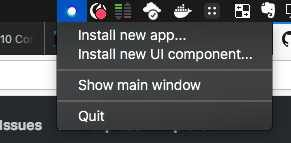
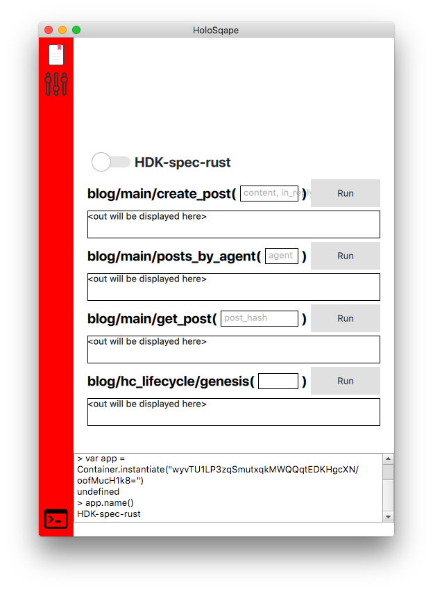

# Qt Holochain Containers

[](http://holochain.org/)
[](https://waffle.io/holochain/org)
[](https://chat.holochain.net)

Multiplatform Holochain containers for the installation and execution of hApps based on Qt, QML and the C bindings of [holochain-rust](https://github.com/holochain/holochain-rust).

This repository contains two different containers, both based on the same Qt <> C bindings of `holochain-rust`. There are several sub directories in this repo containing separate sub projects.

[Holosqape](#holosqape) is for the installation and execution of hApps, including their user interfaces. The container runs in the background and is accessible via a system tray icon.

[Hcshell](#hcshell) shares its configuration with HoloSqape, but allows CLI driven installation and execution of apps. This provides, among other things, an environment for running DNA and Zome tests, including multi-user scenario tests.

Both of these also enable the usage of a [websocket](#websockets) based connection, and the calling of Holochain Zome functions from there, opening up all the possibilities of web based UIs and beyond.

You can read more about these below, or skip straight to [installation](#installation).

## Holosqape
Holosqape manages installed Holochain apps and currently sports a generic UI that creates widgets and buttons for each zome function an app implements automatically. It also includes a JavaScript based console in which apps can be instantiated, this implements the exact same API as in `hcshell`, and the API is described [below](#the-container-object).

While running HoloSqape, a websocket server is also open, that supports the interaction between any web-based (or websockets compatible) client and your Holochain container and instances. More details [below](#websockets).




### Root UI Components
HoloSqape is the proto Holochain browser and thus makes it possible to add UIs in the form of QML components dynamically.

Soon it will sport a general UI with sophisticated widget system (as described [here](https://medium.com/holochain/holochain-reinventing-applications-d2ac1e4f25ef)) that can talk to all installed Holochain apps alike and compose UI widgets as representations for app entries in the same scene. App developers will be able to ship Holochain apps with those entry components and HoloSqape will have a plugin system for these **widget components**.

Currently it only supports installation and usage of **root components**.
A root component is a full monolithic UI - similar to whole window or browser tab. HoloSqape shows the icon of a root component in the red docker bar on the left. Clicking an icon will load the component and have it replace the current full-screen UI.

HoloSqape comes with a generic root component but more can be installed through the system tray menu. The file dialog expects a directory.

**Root component directory contents:**

* main.qml
* docker_icon.png
* (any other QML components used by main.qml)

## Hcshell

`hcshell` is a command line tool for executing javascript files that perform scenario and unit testing for Holochain DNAs and their Zomes. Once `hcshell` is installed ([see below](#installation)) it is called from a command line, and passed a JS file to execute. In terms of Javascript syntax, ES5 is safe, but check the [QJSEngine documentation](http://doc.qt.io/qt-5/qtqml-javascript-functionlist.html) to be completely sure of syntax compatibility.

### How To Use Hcshell
In order to test a Holochain app we need to be able to load it, and run it. For this, we have `hcshell`.

`hcshell` has three primary functions:
1. an interactive console, for doing live experimentation in Javascript
2. an optional websocket server, for connecting from web browsers and other clients into a Holochain app
3. Javascript script execution, where the Container described below is also available for testing

Once `hcshell` is installed successfully, here is how to use it.

**Interactive Console**

Without any arguments passed, running `hcshell` will simply launch the interactive console. Try it! Run
```
hcshell
```
in your terminal and see what happens! You should see a big introductory message, and below it is an input where you can type. This is a Javascript ES5 console, so code must use that syntax. Press Ctrl-C to quit. 

Note, the directory from which you start `hcshell` interactive is important, if you want to run `Container.loadAndInstantiate("appname.dna.json")` and have it succeed. You can provide a relative path to `loadAndInstantiate` to your packaged application DNA file, from the directory where you launched `hcshell`.

**Starting Websocket Server**

To start an `hcshell` container running, with an attached websocket server, run the following:
```
hcshell -w 8888
```

`-w` indicates to attach the websocket server and `8888` specifies the port on your device to run that server at. It will not work without the port specified.

So now an interactive console is simultaneously open at the same time as your websocket server. This means that you could do things within the console that affect the websocket calls, and vice versa. Again, press Ctrl-C to quit.

See below on the [websockets](#websockets) section for more details on how to interact with it.

**Executing a JS script file**

Executing a script file using `hcshell` has the primary use case of writing tests in Javascript for your DNA. While it is often used in the context of `hc test` from the [holochain-cmd command line tools](https://github.com/holochain/holochain-cmd), it can definitely be directly used as well. Using it directly is likely useful in script files for example.

In order to execute a script file, you must have a script file. It could be as simple as a javascript file that had a `console.log`. So say that the following file was sitting within your active CLI directory: 

*hello-testing.js*
```
console.log("hello testing");
```

To execute that script file with the container, run the following:
```shell
hcshell hello-testing.js
# output: hello testing
```

The argument `hello-testing.js` given is the relative path to the file to be executed.

To see a fuller example of a test file, and configuration for being able to write ES6 javascript, please visit the [example JS tests repo](https://github.com/holochain/js-tests-scaffold).

#### The Container object
Whether passing a script, or using the interactive mode, `hcshell` adds a global object `Container` to the context before execution. The `Container` object currently has the following methods (note that while this is pre-release, this API is completely subject to change):

* installedApps()
* instantiate(dnaHash)
* installApp(filename)

and more as can be seen in [container.h](bindings/container.h).

`instantiate()` returns an `App` object as defined in [app.h](bindings/app.h) with a method

* `call(zome_name, capability_name, function_name, parameters)`

(amongst others) which calls the specified zome function, blocks, and returns the result.

This enables us to write code like this:

```javascript
var dnaHash = Container.installedApps()[0]
var app = Container.instantiate(dnaHash)
// app is actually a C++ object that wraps the Rust Holochain instance
app.name() // -> App name defined in DNA
app.start() // starts the instance's event loop and later will start the network node and DHT (not implemented in Rust yet)
var result = app.call("zome name", "capability name", "function name", "parameters") // runs the zome function which involves interpreting the app's WASM code
```

To see fuller documentation on this, please visit the [example JS tests repo](https://github.com/holochain/js-tests-scaffold).

## Websockets
With whatever websocket client you are using, there is a very simple api for connecting to the container.

First ensure the websocket connection is open, once you attempt connection.

Then, you can emit events of the following signature:
- **event name:** String: "dna_hash/zome_name/capability_name/function_name"
- **event argument:** JSON string, e.g.: "{"key":"value"}"

The response you will get is the result of calling that particular Zome function within your application. Please note that this API is still subject to minor changes.

If you are using Javascript, you can use the very thin Holochain websockets library found [here](https://github.com/holochain/hc-web-client).

Note that at the moment the server only implements the `ws://` protocol, but that full support for `wss://` secured connections will be implemented.

## Qt <> C Bindings for holochain-rust

The **bindings** folder contains the Qt/C++ wrappers around the Holochain Rust code that is made available in the form of plain C functions and structs. This project makes Holochain available as Qt-based QObjects that can easily be plugged into Qt script engines. This project compiles to a static library.

# Installation

While this repository is still pre-release, there are no pre-built libraries yet, so the source code must be cloned and compiled on your computer. In the future, installation of these tools will be dramatically simplified.

### Dev Dependencies

* [Rust](https://www.rust-lang.org/en-US/install.html)
	* The `nightly` toolchain of Rust is needed for compiling Holochain, `stable` will not work
	* Once you follow the initial install instructions, run the following, which install the nightly toolchain, and set it as the default toolchain:
	* `rustup toolchain install nightly`
	* `rustup default nightly`
* [Qt](http://doc.qt.io/qt-5/index.html)
	* Qt is a framework for C++, which is used to interface with the C bindings of holochain-rust
	* For macOS (and with [brew](https://brew.sh/) on your computer), to install just run: `brew install qt`
	* For linux systems you may need to install [some dependencies](http://doc.qt.io/qt-5/linux.html) for successful build
		* special linux note: the builds will fail without access to Qt, QtWebsockets, and readline, so run...
		  ```
		  apt-get update && apt-get install --yes \
		  qtdeclarative5-dev \
		  libqt5websockets5-dev \
		  libreadline6-dev
		  ```
* [cmake](https://cmake.org/install)
	* `cmake` is required in your CLI to accomplish the `make` compile steps that follow

 First, clone this repo to your computer. Do not name your folder anything different than `holosqape`, you will break the build.

```
git clone https://github.com/holochain/holosqape.git
cd holosqape
```

From within the root directory of this project, you must get and build Holochain itself which is added as a git submodule:

```
git submodule init
git submodule update
```

There are a couple of installation variants that follow, pick the ones that suits your needs.

Whether installing `holosqape`, `hcshell` or both, you need to compile Holochain.

#### HC Build Option 1: Building for release use

First, compile Holochain:
```
cd holochain-rust
cargo build --release
cd ..
```

#### HC Build Option 2: Building Holochain for development (with debugging)

```
cd holochain-rust
cargo build
cd ..
```

#### Qt Build Option 1: Installing Holosqape AND Hcshell

You can either use [Qt Creator](https://en.wikipedia.org/wiki/Qt_Creator) to build Hcshell and Holosqape, or the command line.

##### Sub-Option 1: Install them with Qt Creator
Open Qt Creator and open the top level folder as a project there. Select the `all.pro` file and build it. This is a good option if you want to build for Android or iOS.

##### Sub-Option 2: Install them with Qt CLI tools

In the root project directory, you need to use Qt to create a Makefile.

IF you selected HC Build Option 1 (release use) for Building Holochain, run the following:

`qmake`

IF you selected HC Build Option 2 (development use) for Building Holochain, run the following:

`qmake CONFIG+=debug`

After one of those two options has completed, run the following, which compiles binaries, based on the new Makefile:

`make`

Just make sure you run matching build configurations (i.e. debug/release).

#### Qt Build Option 2: Installing ONLY Hcshell or Holosqape

Here, we will only cover the CLI approach to building one or the other. In either case, the `bindings` need to be compiled:

```shell
cd bindings
qmake # or with CONFIG+=debug
make
cd ..
```

##### Sub-Option 1: Build hcshell only
```shell
cd hcshell
qmake # or with CONFIG+=debug
make
cd ..
```

##### Sub-Option 2: Build holosqape only
```shell
cd holosqape
qmake # or with CONFIG+=debug
make
cd ..
```

#### Adding `hcshell` to your $PATH

In order to be able to utilize the `hcshell` binary from any directory in the terminal, the folder containing the binary should be added to the $PATH environment variable in use by your terminal.

##### On MacOS and Linux
Depending on your configuration, you should have either a `~/.profile` or `~/.bash_profile` file.

Assuming that the the repository was cloned into your HOME directory (`~`), you would add the following line to your terminal profile file, using a text editor. Change `$HOME/holosqape/hcshell` to point to the actual `hcshell` sub-directory on your computer, if it's different than that.

`export PATH="$HOME/holosqape/hcshell/hcshell.app/Contents/MacOS:$PATH"`

Save the file, and open a new terminal window, or use
`source ~/.profile` or `source ~/.bash_profile` to refresh the $PATH in your current terminal window.

##### On Windows
Coming soon...

#### Troubleshooting
If you run into issues relating to the `qmake` command, try deleting `.qmake.stash`, and rerunning the intended command. Sometimes bad configurations get cached.

## Contribute
Holochain is an open source project.  We welcome all sorts of participation and are actively working on increasing surface area to accept it.  Please see our [contributing guidelines](https://github.com/holochain/org/blob/master/CONTRIBUTING.md) for our general practices and protocols on participating in the community.

## License
[](http://www.gnu.org/licenses/gpl-3.0)

Copyright (C) 2018, Holochain Trust

This program is free software: you can redistribute it and/or modify it under the terms of the license p
rovided in the LICENSE file (GPLv3).  This program is distributed in the hope that it will be useful, bu
t WITHOUT ANY WARRANTY; without even the implied warranty of MERCHANTABILITY or FITNESS FOR A PARTICULAR
 PURPOSE.

**Note:** We are considering other 'looser' licensing options (like MIT license) but at this stage are using GPL while we're getting the matter sorted out.  See [this article](https://medium.com/holochain/licensing-needs-for-truly-p2p-software-a3e0fa42be6c) for some of our thinking on licensing for distributed application frameworks.
