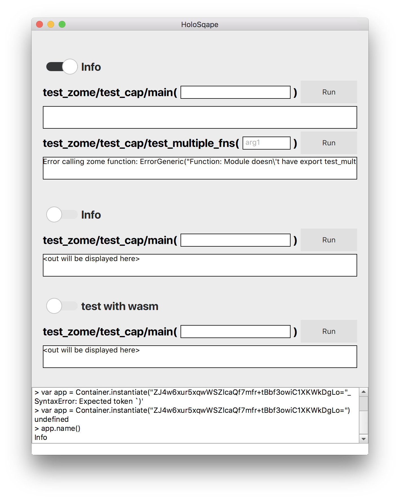

# HoloSqape
A multiplatform Holochain app container that runs in the background and is accessible via a system tray icon based on Qt, QML and the C bindings of [holochain-rust](https://github.com/holochain/holochain-rust).




## Dev Dependencies

[Rust](https://www.rust-lang.org/en-US/install.html)
[Qt](http://doc.qt.io/qt-5/index.html)

Note that on linux systems you may need to install [some dependencies](http://doc.qt.io/qt-5/linux.html) for successful build.

## Build
First you must get and build Holochain itself which is added here as a submodule:

```
git submodule init
git submodule update
```

Then you can build it just with:

```
cd holochain-rust
cargo build
```

given that you have rust installed.

Now either open and build holosqape.pro with [Qt Creator](https://en.wikipedia.org/wiki/Qt_Creator) (esp. if you want to build for Android or iOS) or run:

```
qmake
make
```

## Sub directories
This repository consist of several sub directories containing separate sub projects.

* **holochain-rust** contains the Holochain repository as a sub-module. This project compiles to a static library.
* **bindings** contains Qt/C++ wrappers around the Holochain Rust code that is made available in the form of plain C functions and structs. This project makes Holochain available as Qt-based QObjects that can easily be plugged into Qt script engines. This project compiles to a static library.
* **holosqape** contains the QML based GUI project wich compiles to an executable that can be build for all platforms supported by Qt. It manages installed Holochain apps and currently sports a generic UI that creates widgets and buttons for each zome function an app implements automatically. It also includes a JavaScript based console in which apps can be instantiated.
* **holoconsole** this builds to another executable that basically hosts the same functionality as holosqape but without GUI. Instead it has some compatibility shims to enable running JavaScript libraries such as [Tape](https://github.com/substack/tape). It's main purpose is hosting an environment for app tests, including scenario integration tests.
* **app-test-scaffold** this is an example showing how to build an app test script to run with holoconsole.


## App tests

### Binding objects
In order to test a Holochain app we need a JS script that we run in holoconsole. The script engine adds a global object ```Container``` to the context before loading and running the user script. It currently has the following methods:

* installedApps()
* instantiate(dnaHash)
* installApp(filename)

and more as can be seen in [container.h](bindings/container.h).

instantiate() returns an ```App``` object as defined in [app.h](bindings/app.h) with a method

* call(zome_name, capability_name, function_name, parameters)

(amongst others) which calls the specified zome function, blocks, and returns the result.

This enables us to write code like this:

```javascript
let dnaHash = Container.installedApps()[0]
let app = Container.instantiate(dnaHash)
// app is actually a C++ object that wraps the Rust Holochain instance
app.name() // -> App name defined in DNA
app.start() // starts the instance's event loop and later will start the network node and DHT (not implement in Rust yet)
let result = app.call("zome name", "capability name", "function name", "parameters") // runs the zome function which invovles interpreting the app's WASM code
```


### Using Tape testing framework
To get proper assertions and formatted output we want to use existing JS scripting frameworks. We chose Tape for now because of its mininmal footprint.

In order to build a JS bundle including Tape, we use Webpack. ```app-test-scaffold``` contains a working example which can be run like this:

```
cd app-test-scaffold
npm install
webpack-cli
```
You should now find the output in ```app-test-scaffold/dist/bundle.js```.
Compile holoconsole and run it like this:
```
./holoconsole <path-to-repo>/app-test-scaffold/dist/bundle.js
```

It should give you the following output:

```
$ ./holoconsole ~/code/HoloSqape/app-test-scaffold/dist/bundle.js
QML debugging is enabled. Only use this in a safe environment.
=>true
TAP version 13
# timing test
from test
ok 1 should be equal
ok 2 should be equal
ok 3 should be equal
ok 4 should be equal
ok 5 should be equal

1..5
# tests 5
# pass  5

# ok
```

### Webpack config
If you create your own testing project and you want to use Webpack for bundling make sure to set the following node parameters to have the output run in HoloSqapes JS engine:

```
node: {
	fs: 'empty',
	setImmediate: false
}
```

